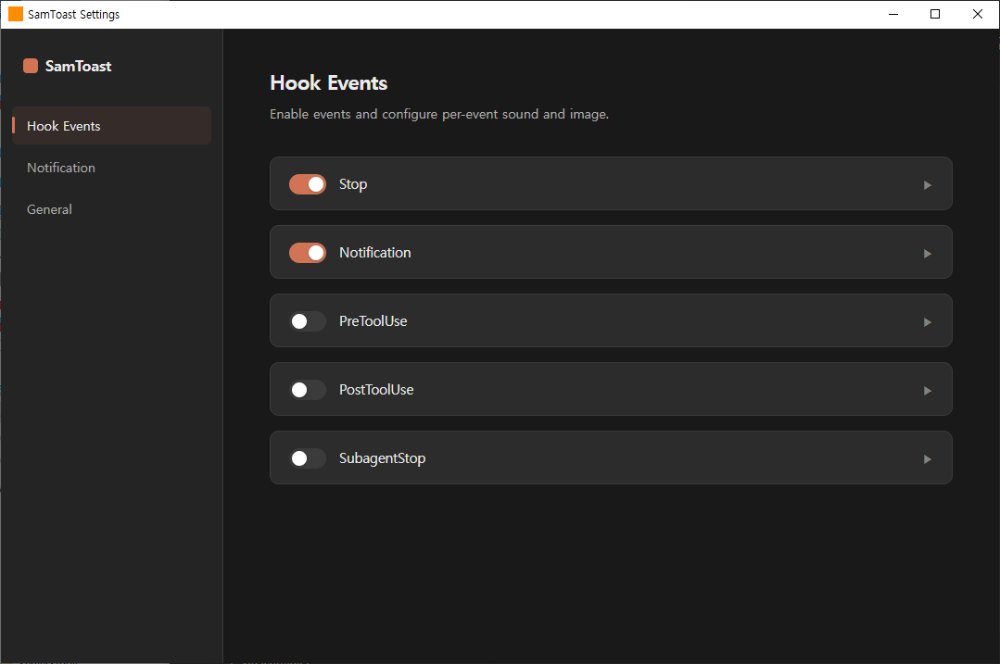
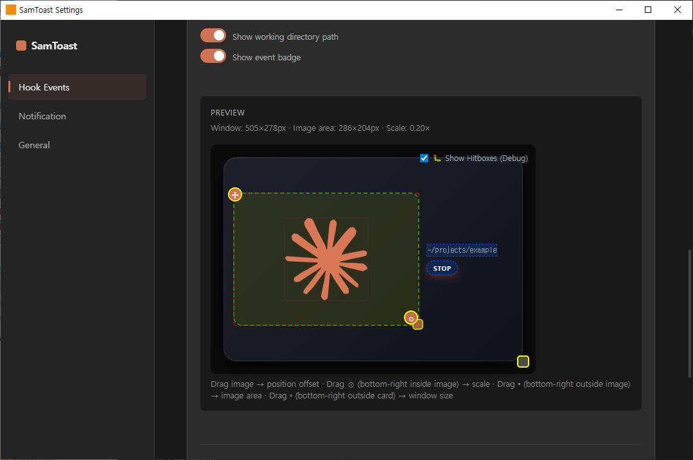
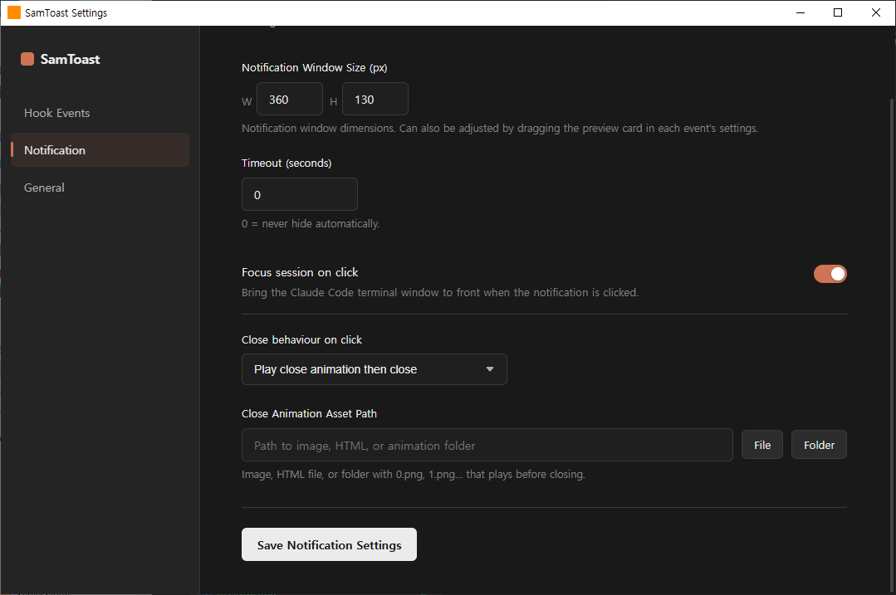
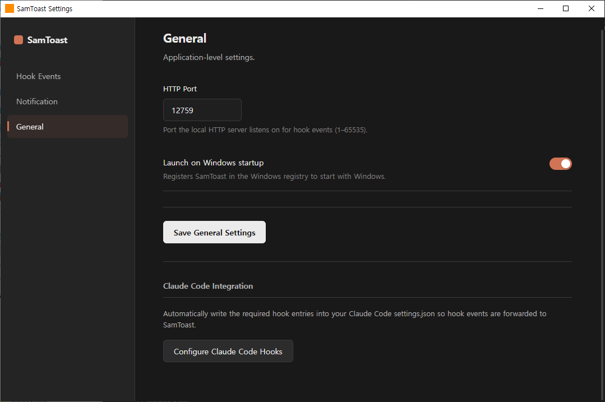

# SamToast

Claude Code 작업 완료 / 입력 대기를 커스텀 알림으로 받아보는 앱

## 기능

- 세션별 독립 알림 창
- png / 애니메이션(pngs) / HTML 지원
  - png/html은 파일 선택으로 설정
  - 애니메이션은 png 파일들이 저장되어 있는 폴더로 설정
  - sample 폴더 참고
- 커스텀 알림음 (with loop 설정)
- 화면 어디든 자유롭게 배치 가능 (dpi 지원)

## 설정 방법

`SamToast.exe` 실행 후 시스템 트레이 상 아이콘 좌클릭 하면 설정 GUI가 뜹니다.

### Hook Events

hook 별로 원하는 창크기, 연출, 문구 등을 설정할 수 있습니다.  
문구의 폰트 크기는, 마우스를 올린 후 `SHIFT + 마우스휠`로 조절할 수 있습니다.

### Notification

알림음의 timeout을 지정할 수 있습니다.

> 기본값 : 0 == 누르기 전까지 안 닫힘

### General

`Configure Claude Code Hooks` 버튼을 통해 hook을 자동 설정할 수 있습니다.
